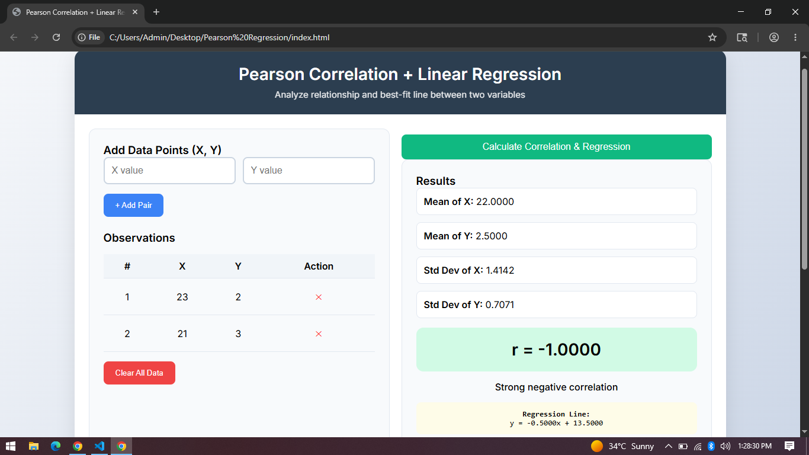
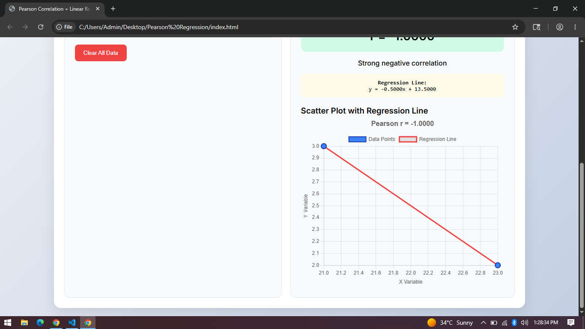

# Pearson Regression Analyzer

A clean, interactive web application to calculate the **Pearson Correlation Coefficient** and **Linear Regression** between two variables. Built for educational, analytical, and development purposes.

## Features

- Add X and Y data points manually
- Real-time data table with remove option
- Calculates:
  - Pearson Correlation Coefficient (r)
  - Arithmetic Means
  - Sample Standard Deviations
  - Linear Regression Equation (`y = mx + b`)
- Interactive Scatter Plot with **Regression Line** (using Chart.js)
- Clean, modern, and responsive UI
- Input validation and error handling
- All mathematical calculations implemented from scratch (no external math libraries)

## Project Structure

Pearson-Regression/
├── index.html
├── style.css
├── main.js
├── README.md
└── screenshots/
    ├── screenshot-1.png
    ├── screenshot-2.png

How to Use

## Clone or download the project

Open index.html in any modern web browser
Enter X and Y values and click + Add Pair
Add at least 2 data points
Click Calculate Correlation & Regression
View results, interpretation, regression equation, and scatter plot with best-fit line

## Example Use Cases

Relationship between temperature and ice cream sales
Study hours vs exam scores
Advertising spend vs revenue
Height vs weight correlation

## Technologies Used

HTML5
CSS3 (Modern styling)
Vanilla JavaScript (ES6+)
Chart.js (for scatter plot and regression line)

## Screenshots

1. Main Interface with Data Input

1. Results with Regression Line

## Future Enhancements (Planned)

CSV file upload support
Export results as PDF/CSV
Dark mode
Data persistence (localStorage)
Multiple dataset comparison

Author
Haseen
Built as a practical mathematics tool for development and analysis.

Made with ❤️ for learning and quick statistical analysis.
